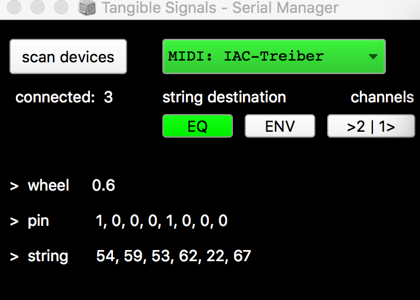

# Serial GUI


Serial GUI - a helper for "Tangible Signals" devices to connect to the web-based music environment [Welle](https://github.com/JnsVttr/Welle), e.g. convert from serial input to MIDI and MIDI to serial with SuperCollider. 


Detects ESP32 devices in ```/dev/``` based on the namespace ```*SLAB*``` . Connects to serial ports and sends a serial command to each device to request identification (response e.g. "string"). Once identified, each devices is assigned to send/receive serial messages/ MIDI messages. 


More on "Tangible Signals" here: https://tamlab.ufg.at/projects/tangible-signals




